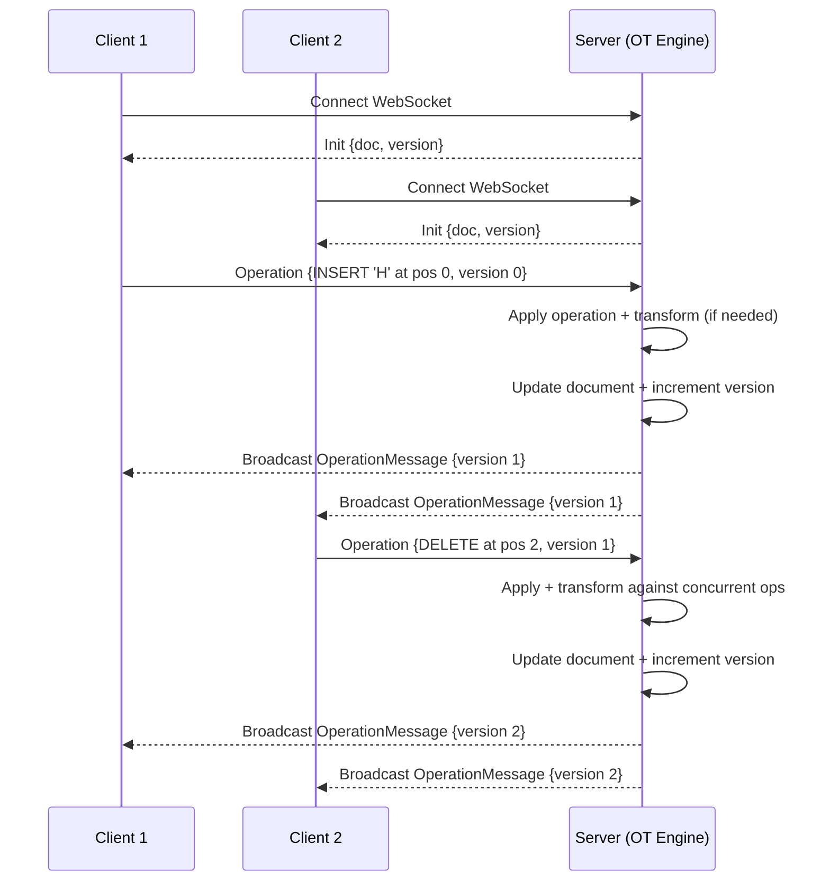

# Aether

This project is a **real-time collaborative document editing system** built using:

- **Spring Boot** for the backend server
- **WebSockets** for bi-directional communication
- **Operational Transform (OT)** as the core algorithm for handling concurrent edits

---

## Features
- Real-time document synchronization between multiple clients.
- Operational Transform (OT) engine ensures consistency across concurrent edits.
- Automatic version tracking of the document.
- WebSocket-based broadcasting of updates to all connected clients.
- Lightweight integration tests for verifying multi-client collaboration.

---

## What is Operational Transform (OT)?

**Operational Transform (OT)** is an algorithm originally designed for collaborative systems like **Google Docs**.  
Its purpose is to handle **concurrent edits** made by multiple users to a shared document, ensuring **consistency** and **intention preservation**.

### Example Problem
- User A deletes a character at position 5.
- At the same time, User B inserts a new word at position 3.
- Without OT, the final document state could diverge depending on the order of operations.

### How OT Fixes This
- Every operation is associated with a **version number**.
- When a new operation arrives, if it is based on an **older version**, the OT engine **transforms** it against all operations that came after.
- This ensures all clients converge to the **same document state**.

---

## Operation Model

```java
public class Operation {
    public enum Type { INSERT, DELETE }
    private Type type;
    private int position;
    private String character;
    private int version;
}
````

* **type**: `INSERT` or `DELETE`
* **position**: Index in the document
* **character**: Character (or string) being inserted/deleted
* **version**: Document version when the operation was created

---

## WebSocket Flow



1. **Client connects**

   * Server sends the current document + version (`init` message).

2. **Client sends an operation**

   ```json
   {
     "type": "operation",
     "op": {
       "type": "INSERT",
       "position": 0,
       "character": "H",
       "version": 0
     }
   }
   ```

3. **Server applies OT**

   * Updates the document.
   * Increments the version.

4. **Broadcast**

   * Server sends the transformed operation to **all clients** (including the sender).

---

## Testing

We use integration tests to verify multi-client collaboration:

* Clients receive **init** messages on connection.
* When one client submits an operation, **all clients** receive the updated operation broadcast.

Run tests with:

```bash
./mvnw test
```

---

## Running the Project

1. Start the Spring Boot server:

   ```bash
   ./mvnw spring-boot:run
   ```

2. Connect a WebSocket client to:

   ```
   ws://localhost:8080/ws/docs
   ```

3. Send operations and watch them broadcast in real time!

---

## References

* Ellis, C. A., & Gibbs, S. J. (1989). *Concurrency control in groupware systems.*
* Google Docs architecture insights on OT vs CRDT.
* [Spring WebSocket Documentation](https://docs.spring.io/spring-framework/docs/current/reference/html/web.html#websocket)

---

## Future Work

* Add **CRDT** mode for comparison with OT.
* Support for **rich text operations** (formatting, styles).
* Persistence layer for saving and loading documents.
* Conflict resolution improvements for batched operations.

